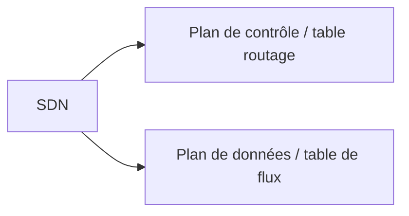

# GTI611 - Cours 7 - Réseaux Programmables

## Protocole OpenFlow

Il existe des plan de contrôle : table routage et des plan de données (commutation) pour le transfert de paquet.

SDN sépare ses deux couche : un côté serveur pour le plan contrôle et un "switch" pour le plané données. La switch devient une table de "flux."

Ça veut dire que les routes peuvent changer automatique en fonction de ce que les applications veulent.

La force de SDN est donc de pouvoir programmer tout ce qu'on veut.
* Programmable
* Souple
  * QoS
  * Sécurité
* Contrôle centralisé
  * Cue globable du réseau qui est vue par les application comme un seul noeud réseau logique.
* Configuration par programmes
* Standards non liés à un manufacturier

## Table de flux et QoS
* Permet d'implémenter différentes opérations de QoS
* Gérer par exemple le taux (rate) de data qui arrive à une interface.

