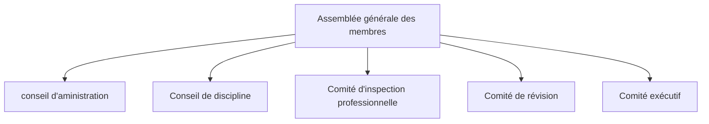

# PEP110 - Cours 2
## Rappel sur le dernier cours
L'ordre des ingénieurs peut seulement contrôler les ingénieurs, pas les autres. Par exemple, elle ne peut pas faire de contrôle sur les membres de la direction d'une enretprise qui sollicite ou souhaite optenir des travaux en ingénierie.

Différence entre profession et titre distingué.

## Cours d'éthique

